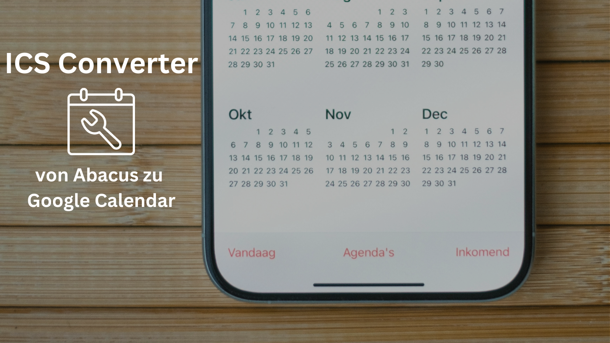

ICS Converter for Abacus ERP
A simple web application built to solve a specific problem: converting .ics calendar files exported from the Abacus ERP system into a format that is fully compatible with Google Calendar.

The Problem
The .ics files generated by Abacus ERP are not readily compatible with Google Calendar's importer. This is primarily because they use non-standard fields (like X-ALT-DESC for event descriptions) and do not escape special characters (like commas), which causes Google's importer to fail.

The Solution
This tool provides a simple web interface where a user can upload their Abacus-generated .ics file. The backend, built with Python and Flask, then performs the following actions:

Removes superfluous and non-standard fields.

Reads the event description from the X-ALT-DESC field.

Creates a standard DESCRIPTION field with the correct content.

Escapes special characters in the description to comply with the iCalendar standard.

Returns a clean, compatible .ics file to the user for download.

How to Use
Access the live application at the public URL.

Click the "Select .ics File" button and choose the file you exported from Abacus.

The conversion happens automatically, and a new file named google_compatible_calendar.ics will be downloaded to your computer.

Import this new file into Google Calendar.
